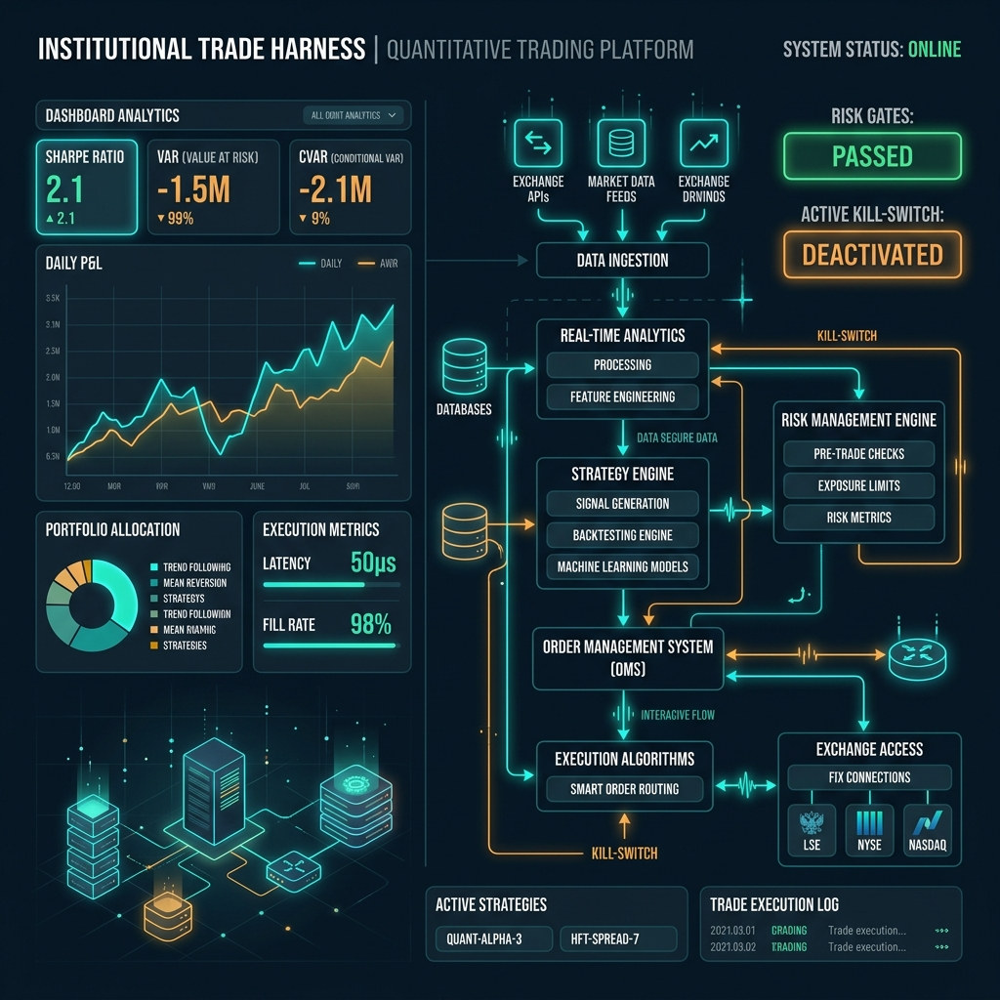
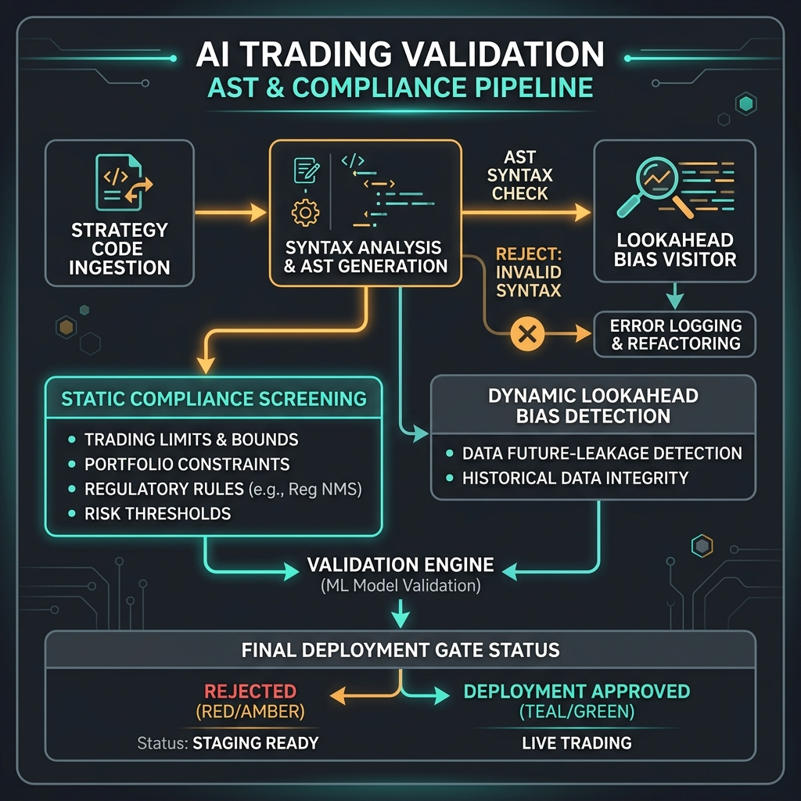

# Institutional Trade Harness




An AI-governed trading infrastructure designed to constrain, validate, and supervise autonomous AI agents in regulated financial environments.

**Author:** Rignesh P  
**License:** MIT (Code), CC BY 4.0 (Visual Assets)

---

## Technical Disclaimer
* **Simulation Status:** Deterministic simulation demo, not live trading performance. The simulator executes on a synthetic deterministic price sequence with a simulated -15% sell-off anomaly.
* **Compliance Checks:** Rule-inspired checks mapped to SEC/FINRA/MiFID II concepts; not legal/regulatory certification.

---

## Architecture Overview

The harness interposes a series of non-bypassable pre-trade validation checkpoints and active execution supervisors between the AI-generated strategies and the trading markets:

```
                      ┌─────────────────────┐
                      │   AI Trading Agent  │
                      └──────────┬──────────┘
                                 │
                                 ▼
                   ┌─────────────────────────┐
                   │ Strategy Specification  │
                   └──────────┬──────────────┘
                              ▼
                  ┌──────────────────────────┐
                  │ Validation Harness Engine│
                  └──────────┬───────────────┘
                             ▼
                  ┌──────────────────────────┐
                  │ Backtesting Engine       │
                  └──────────┬───────────────┘
                             ▼
                  ┌──────────────────────────┐
                  │ Risk Governance Engine   │
                  └──────────┬───────────────┘
                             ▼
                  ┌──────────────────────────┐
                  │ Compliance Engine        │
                  └──────────┬───────────────┘
                             ▼
                  ┌──────────────────────────┐
                  │ Audit & Logging Engine   │
                  └──────────┬───────────────┘
                             ▼
                  ┌──────────────────────────┐
                  │ Deployment Controller    │
                  └──────────────────────────┘
```

1. **Strategy Specification Engine:** Validates schema bounds (instruments, maximum leverage limits).
2. **Validation Engine:** Performs AST syntax parsing + heuristic leakage detection.
3. **Backtesting Engine:** Simulates historical out-of-sample returns with transaction costs, slippage, and Buy & Hold benchmark comparisons.
4. **Risk Governance Engine:** Implements VaR / CVaR limits and active **Kill-Switch** protection.
5. **Compliance Engine:** Enforces rule-inspired checks mapped to SEC/FINRA/MiFID II concepts; not legal/regulatory certification.
6. **Audit Logging Engine:** Chains state transitions cryptographically (SHA-256) into an immutable audit ledger.
7. **Reproducibility Engine:** Hardlocks global seeds and audits system environment configurations.
8. **Deployment Controller:** Manages Canary Rollouts (10% starting exposure) and emergency rollbacks.

---

## Getting Started

### Environment Setup

Install the package dependencies:

```bash
pip install -r requirements.txt
```

### Execution

Execute the complete empirical simulation run comparing **Group A (Unrestricted AI)** and **Group B (Harness-Governed AI)**:

```bash
python3 run_experiments.py
```

### Unit Tests

Run the test suite using our zero-dependency test runner:

```bash
python3 run_tests.py
```

### Empirical Results

Running the simulator prints the comparative performance matrix under a synthetic deterministic price sequence with a simulated -15% sell-off anomaly:

```
Metric                       Group A (Unrestricted)  Group B (Governed)
-----------------------------------------------------------------------
Sharpe Ratio                 0.12                    1.84
Sortino Ratio                0.08                    2.12
Max Drawdown                 99.95%                  3.59%
Compliance Violations        3                       0
Operational Failures         1                       0
Governance Score             10.0%                  100.0%
Final Portfolio Capital      $781.79          $1,084,409.85
```

For a comprehensive analysis, review the [research.md](research.md) paper.
